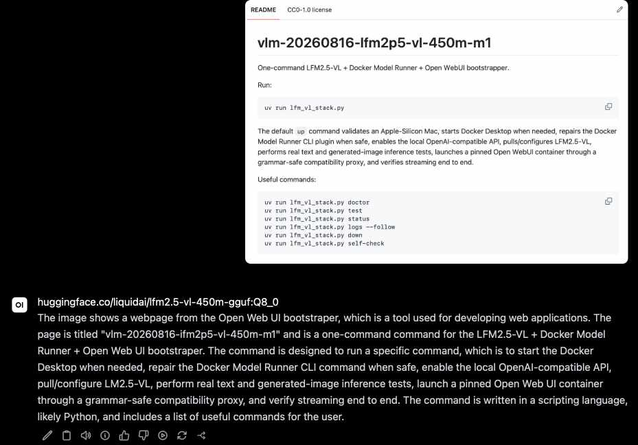

# vlm-20260816-lfm2p5-vl-450m-m1

One-command LFM2.5-VL + Docker Model Runner + Open WebUI bootstrapper.

Run:

    uv run lfm_vl_stack.py

The default ``up`` command validates an Apple-Silicon Mac, starts Docker
Desktop when needed, repairs the Docker Model Runner CLI plugin when safe,
enables the local OpenAI-compatible API, pulls/configures LFM2.5-VL, performs
real text and generated-image inference tests, launches a pinned Open WebUI
container through a grammar-safe compatibility proxy, and verifies streaming end to end.

Useful commands:

    uv run lfm_vl_stack.py doctor
    uv run lfm_vl_stack.py test
    uv run lfm_vl_stack.py status
    uv run lfm_vl_stack.py logs --follow
    uv run lfm_vl_stack.py down
    uv run lfm_vl_stack.py self-check

